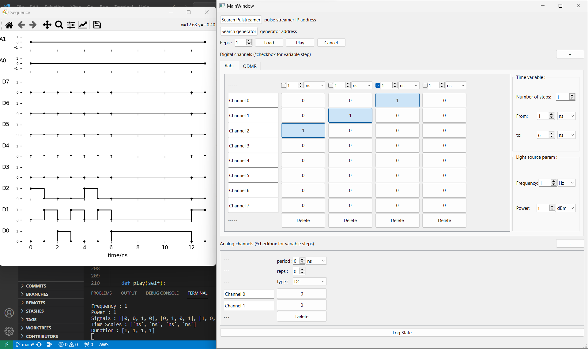

# Control interface for ODMR and Rabi experiments

**Description:** This project is for study the quantum information present in NV defects with ODMR and Rabi pulses experiments.

**Machines used:**
+ Pulse Streamer 8/2 : https://www.swabianinstruments.com/pulse-streamer-8-2/
+ Moku Pro : https://www.liquidinstruments.com/products/hardware-platforms/mokupro/
+ Rohde & Schwarz SMB100A
# Demos

**First version**

**ODMR & Rabi version**

# Required set up

**Install conda on Linux**

    mkdir -p ~/miniconda3
    wget https://repo.anaconda.com/miniconda/Miniconda3-latest-Linux-x86_64.sh -O ~/miniconda3/miniconda.sh
    bash ~/miniconda3/miniconda.sh -b -u -p ~/miniconda3
    rm -rf ~/miniconda3/miniconda.sh

**[Install conda on Window](https://docs.conda.io/projects/conda/en/latest/user-guide/install/windows.html)**

1. Download the miniconda installer: https://docs.conda.io/projects/miniconda/en/latest/

2. Add conda to env var with following code

        # execute the code below as administrator
        setx PATH "%PATH%;C:\Users\<nom d'utilisateur>\miniconda3" /M

3. Test conda installation

        conda list

**Install RsVISA (this module is for dectecting R&S instruments) :** 

+ [doc](https://scdn.rohde-schwarz.com/ur/pws/dl_downloads/dl_application/application_notes/1dc02___rs_v/1DC02_2e_RS_VISA.pdf)
+ [Downloading page](https://www.rohde-schwarz.com/fr/applications/r-s-visa-note-d-application_56280-148812.html)

**Pull project**

    git clone https://github.com/vuthanhtung2412/ODMR-FOTON.git
    cd ODMR-FOTON

**Set up conda env**

    conda env create --name <ur-env-name> --file environment.yml

**Run the program**

    # rabi odmr version 
    python odmr_rabi_version/ODMRRabiMain.py
    # or intial version
    pyhon initial_version/main.py

# Futher Optional set up

### VSCode extension
+ Gitlens
+ Jupyter
+ Prettier
+ Python
+ Python Environment managemen

### VSCode setup

[Change default terminal to cmd :](https://stackoverflow.com/questions/42729130/visual-studio-code-how-to-switch-from-powershell-exe-to-cmd-exe)
1. Press Ctrl + Shift + P to show all commands.
2. Select Terminal: Select Default Profile.
3. Select Command Prompt (cmd.exe)
### Create QtDesigner shortcut
C:\Users\user_name\ .conda\envs\env-name\Lib\site-packages\PySide6\designer.exe

# Workflows 
1. Design GUI with QtDesigner
2. [Generate .py file from .ui file](https://stackoverflow.com/questions/69077280/converting-ui-file-into-py-using-pyside6)

        pyside6-uic MainWindow.ui -o ui_mainwindow.py
3. Rewrite .py fil, create helper classes so that the GUI is dynamic
4. Connect fonctionali to UI elements
# Explain file structure

+ **demos** : images to flex
+ **initial_version** : first version
+ **odmr_rabi_version** : the current version which connect to both generator and pulse streamer. It can do both ODMR and Rabi experiments.
+ **RsSmbv_examples** : this dir is used to test Python API of the generator
+ **moku_examples** : this dir is used to test Python API of the moku
+ **pulseStreamer_examples** : this dir is used to test Python API of the pulseStreamer
# Useful ressources
+ PySide 6 tutorial : https://www.pythonguis.com/pyside6-tutorial/

+ Moku Python API : https://apis.liquidinstruments.com/examples/python/

+ Pulse Streamer Python API : https://www.swabianinstruments.com/static/documentation/PulseStreamer/

+ Rohde & Schwarz SMB100A : 
    + Pycharm plugin : https://rohde-schwarz.github.io/RsSmbv_PythonDocumentation/getting_started.html
    + Python API : https://rsicpycharmplugin.readthedocs.io/en/latest/ 
# Futures works:

Error handling non found machine 

Load frequency list to Rohde & Schwarz SMB100A 

Ensure every thing is loaded before execution

Moku integration

Rohde & Schwarz SMB100A List mode (load list of frequency)

Switch frequency when receive signal from the Pulse Streamer

Save Pulse Sequence

[QUDI](https://github.com/Ulm-IQO/qudi-core) [(doc)](https://ulm-iqo.github.io/qudi-core/s) might be interesting to look at, however i find it not very promising
